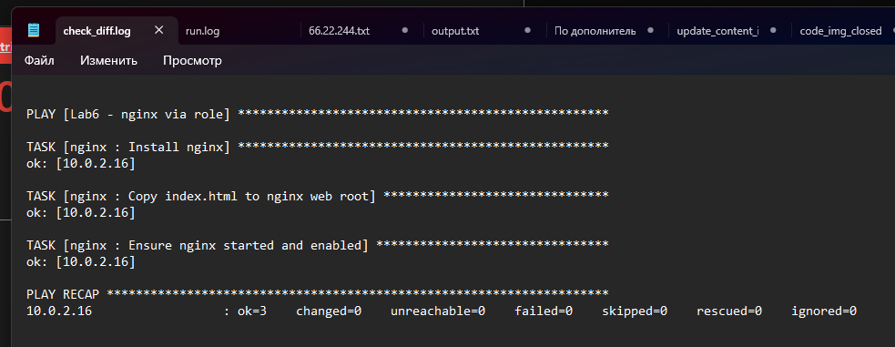
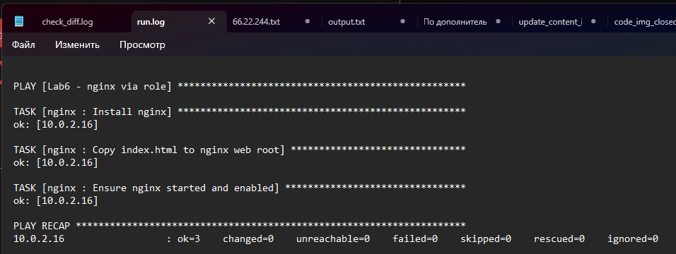
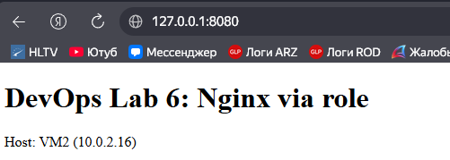
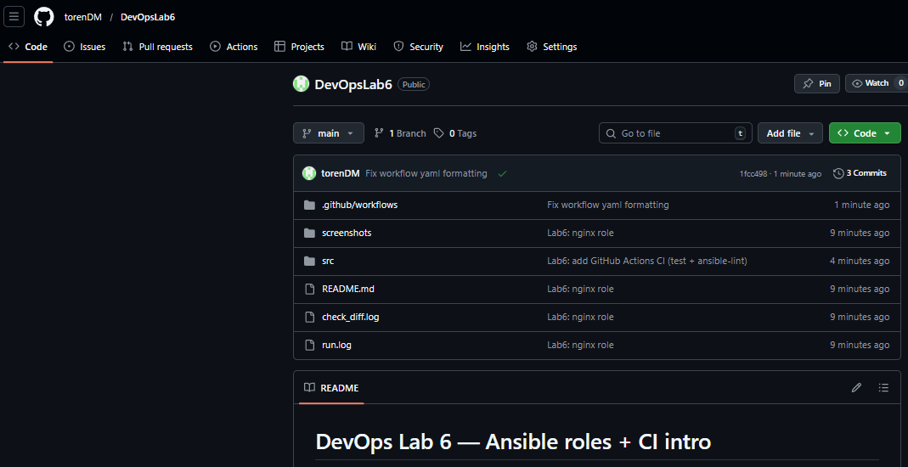
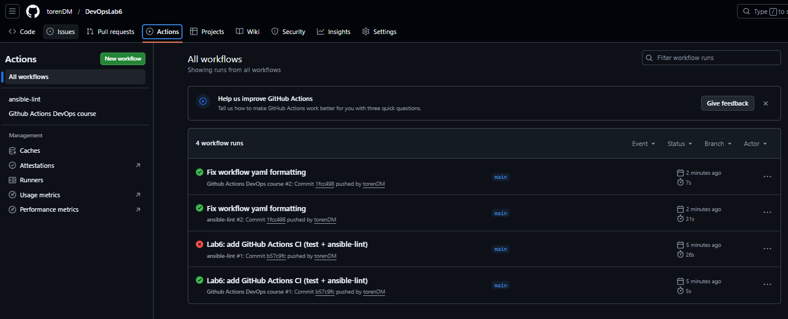

# DevOps Lab 6 — Ansible roles + CI intro

**Демидов Матвей Александрович, ФИТ-1-2024 НМ**  
**Дисциплина:** Методы и инструменты DevOps  
**Лабораторная работа:** ЛР по лекции 6 (Ansible roles, CI intro)

---

## 1) Цель работы
1) Перевести настройку nginx на целевой VM в формат **Ansible Role** и запускать настройку через плейбук, который подключает роль.  
2) Добавить базовые функции **CI** с помощью **GitHub Actions**.

---

## 2) Что сделано
- Создана роль `roles/nginx` (tasks + files)
- Плейбук подключает роль и настраивает nginx на VM2
- Выполнены прогоны `--check --diff` и реальный запуск (логи сохранены)
- Добавлены GitHub Actions workflows:
  - тестовый пайплайн (echo/uptime/pwd/whoami)
  - линтинг `ansible-lint`

---

## 3) Стенд

| Узел | Роль | IP | SSH из Windows |
|---|---|---:|---|
| VM1 | Control Node (Ansible) | `10.0.2.15` | `ssh student@127.0.0.1 -p 2222` |
| VM2 | Managed Node (Nginx) | `10.0.2.16` | `ssh student@127.0.0.1 -p 2223` |

Проверка в браузере Windows: `http://127.0.0.1:8080`

---

## 4) Структура репозитория
- `src/`
  - `playbook.yml` — плейбук, подключающий роль
  - `inventory.ini` — инвентарь (VM2)
  - `ansible.cfg` — настройки Ansible
  - `roles/nginx/` — роль nginx (tasks + files)
- `.github/workflows/`
  - `devops_course_pipeline.yml` — тестовый workflow
  - `lint.yml` — workflow с `ansible-lint`
- `check_diff.log` — запуск `--check --diff`
- `run.log` — реальный запуск
- `screenshots/` — скриншоты выполнения

---

## 5) Запуск (на VM1)
```bash
cd ~/DevOpsLab6/src
ansible-playbook playbook.yml --check --diff
ansible-playbook playbook.yml
```

---

## 6) CI (GitHub Actions)
Workflows запускаются на `push` в ветку `main`.

---

## 7) Скриншоты
### 7.1 Check + diff (failed=0)


### 7.2 Реальный запуск (failed=0) и задачи роли


### 7.3 Результат в браузере


### 7.4 Файлы CI в репозитории


### 7.5 Успешный запуск GitHub Actions

